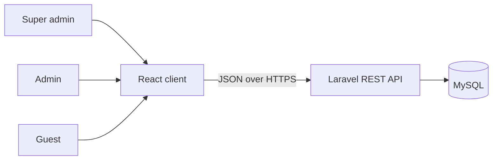
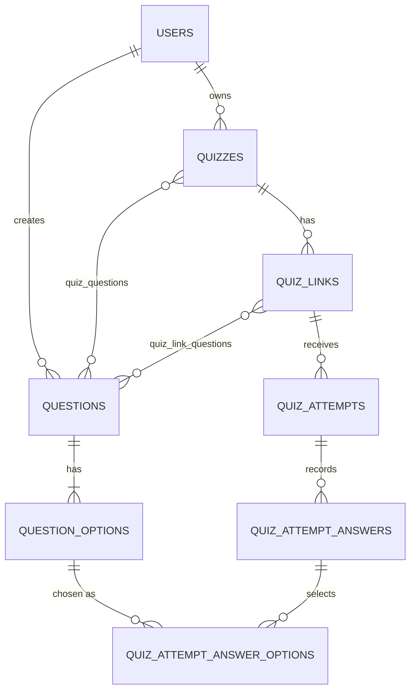

# Quiz App

A role-based quiz platform. Admins build a reusable question bank and share link-scoped quizzes. Guests take them with no account and get server-scored results.


## Overview

Quiz App separates three concerns that most quiz tools mix together: authoring, taking, and oversight.

- **Admins** own a question bank, assemble quizzes from it, and publish shareable links. Each link exposes its own subset of the quiz's questions.
- **Guests** need no account. They open a link, enter a name, take the quiz, and see their score immediately.
- **Super admins** govern the platform: they approve or suspend admin accounts and watch platform-wide usage.

## Features

**Admin**
- Question bank with single-choice and multiple-choice questions. A question and its options are saved together, atomically.
- Quizzes built by picking questions from the bank. A question can be reused across any number of quizzes.
- Multiple shareable links per quiz, each with its own subset of 1 to 10 questions. Links never expire and are switched off manually.
- Reports per quiz: participant name, score, and the link used. Searchable, sortable, and paginated.

**Guest**
- Open a link, enter a name, and take the quiz, optionally against a time limit.
- Immediate score, plus a per-question breakdown of their own answers against the correct ones.
- Unlimited re-attempts.

**Super admin**
- Platform stats: admins (approved and pending), quizzes, links, and submitted attempts.
- Admin directory with search, status filter, and adjustable page size.
- Admin detail with usage counts, and approve or suspend actions. Suspending revokes the admin's active tokens immediately.

## Architecture



The client and API are separate applications that communicate only over HTTP. Admin and super admin requests authenticate with Sanctum bearer tokens. Guest requests are unauthenticated and scoped to a link token.

### Data model



The full schema, authorization rules, and API contract are in [`docs/ARCHITECTURE.md`](docs/ARCHITECTURE.md).

## Engineering highlights

| Concern | Decision |
|---|---|
| **Authorization** | Ownership is enforced with Laravel Policies, not role middleware alone. An admin cannot read or modify another admin's data by guessing an ID. |
| **Cross-resource integrity** | Attaching questions to a quiz or link checks both ownership and membership. A request with any invalid ID is rejected in full, with no partial writes. |
| **Atomic writes** | A question and its options are created and updated in a single database transaction. |
| **Scoring** | Computed server-side only. Single-choice: the selected option must be correct. Multiple-choice: the selected set must exactly equal the correct set, with no partial credit and no negative marking. The client never sends a score. |
| **Answer-data boundaries** | Correct answers are never sent before submission. Guests see a breakdown of their own attempt. Admin report responses are limited to name and score by dedicated API Resources, so answer-level data cannot leak by accident. |
| **Guest sessions** | Attempts are identified by non-sequential UUIDs. Duplicate submissions are rejected, the time limit is enforced on the server, and the public endpoints are rate-limited. |
| **Link tokens** | Cryptographically random and independent of any record ID. |
| **Account governance** | Self-registered admins must be approved before they can sign in. Suspension revokes existing tokens, not just future logins. |
| **Data retention** | Records referenced by attempts are protected by restrictive foreign keys, so historical results stay intact. |

## Tech stack

| Layer | Technology |
|---|---|
| API | Laravel, Sanctum |
| Client | React, TypeScript, Vite, React Router, TanStack Query, React Hook Form, Zod, Tailwind CSS |
| Database | MySQL |

## Status

| Layer | Scope | Status |
|---|---|---|
| API | Authentication and roles | Complete |
| API | Question bank | Complete |
| API | Quizzes and shareable links | Complete |
| API | Guest quiz-taking and scoring | Complete |
| API | Admin reporting | Complete |
| API | Super admin panel | Complete |
| Client | Foundation, auth, admin screens, guest quiz flow, reports, super admin panel | In progress |

The client roadmap is in [`docs/FRONTEND_ARCHITECTURE.md`](docs/FRONTEND_ARCHITECTURE.md).

## API overview

| Area | Endpoints | Access |
|---|---|---|
| Auth | `POST /api/admin/register`, `POST /api/admin/login`, `POST /api/admin/logout`, `GET /api/me` | Public / authenticated |
| Question bank | `GET, POST /api/admin/questions` and `GET, PUT, DELETE /api/admin/questions/{id}` | Admin |
| Quizzes | `GET, POST /api/admin/quizzes`, `GET, PUT, DELETE /api/admin/quizzes/{id}`, `POST /api/admin/quizzes/{id}/questions` | Admin |
| Links | `GET, POST /api/admin/quizzes/{id}/links`, `PATCH /api/admin/links/{id}` | Admin |
| Reports | `GET /api/admin/quizzes/{id}/attempts` | Admin |
| Platform | `GET /api/superadmin/stats`, `GET /api/superadmin/admins`, `GET, PATCH /api/superadmin/admins/{id}` | Super admin |
| Guest quiz | `GET /api/quiz/{token}`, `POST /api/quiz/{token}/start`, `POST /api/quiz/{token}/attempts/{attemptId}/submit`, `GET /api/quiz/{token}/attempts/{attemptId}/result` | Public |
| Diagnostics | `GET /api/ping`, `GET /api/health` | Public |

## Getting started

### Prerequisites

- PHP 8.2+ and Composer
- Node.js 20+ and npm
- MySQL 8+

### API

```bash
cd backend
composer install
cp .env.example .env
php artisan key:generate
# set the DB_* values in .env
php artisan migrate --seed
php artisan serve
```

Check that it is running:

```bash
curl http://localhost:8000/api/ping
```

The seeder creates one pre-approved super admin account. Change its credentials in the seeder before running it anywhere other than local development. Allow the client's origin in the API's CORS configuration.

### Client

```bash
cd frontend
npm install
cp .env.example .env   # set VITE_API_BASE_URL to the API address
npm run dev
```

## Project structure

```
quiz-app/
├── backend/     Laravel API
├── frontend/    React + TypeScript client
└── docs/
    ├── ARCHITECTURE.md
    └── FRONTEND_ARCHITECTURE.md
```

## Roadmap

- Complete the client: authentication, admin screens, guest quiz flow, reports, and the super admin panel
- Automated tests: backend feature tests, client component tests, and one end-to-end test of the guest flow
- Continuous integration for type-checking, linting, and tests
- Deployment

## License

No license has been specified yet.
